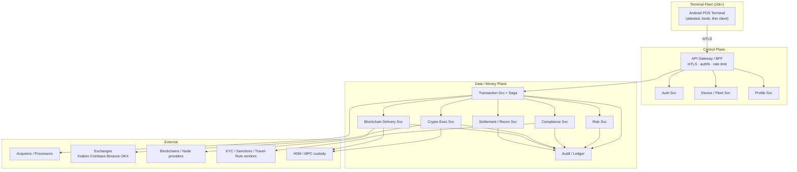
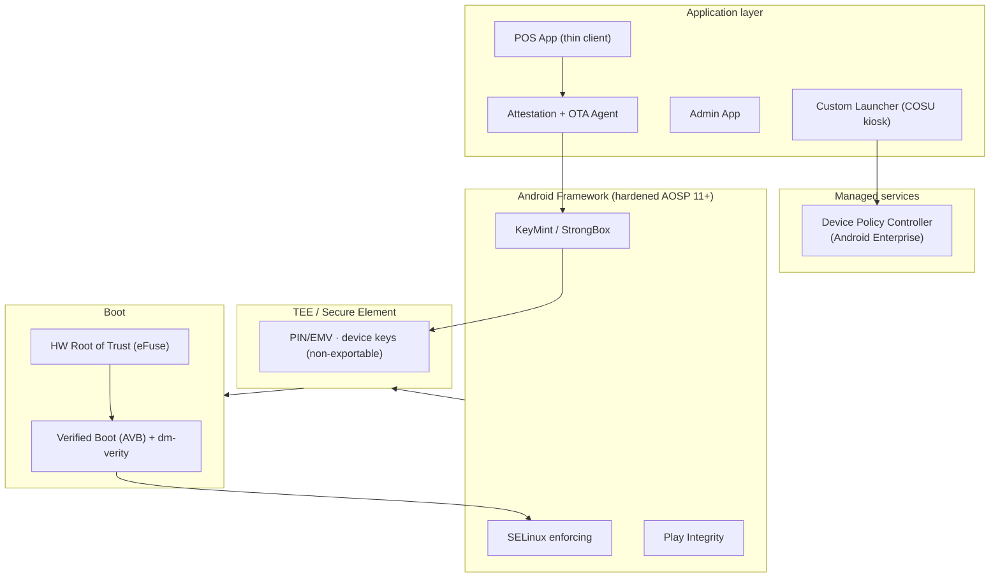
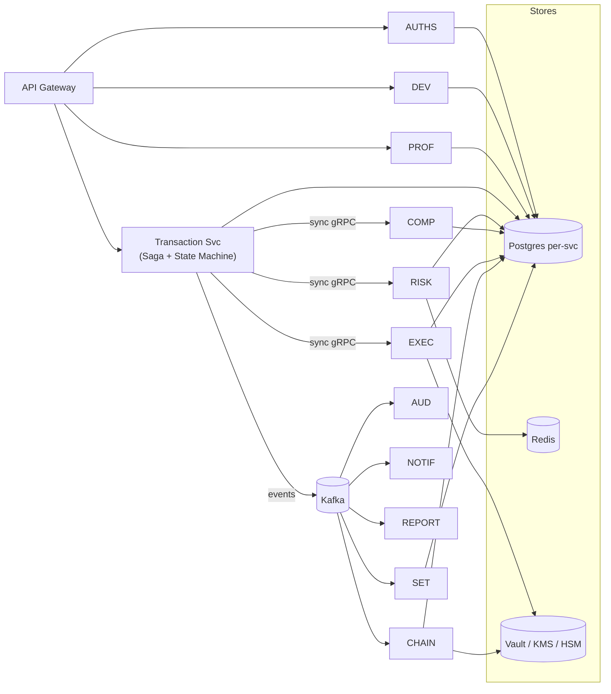
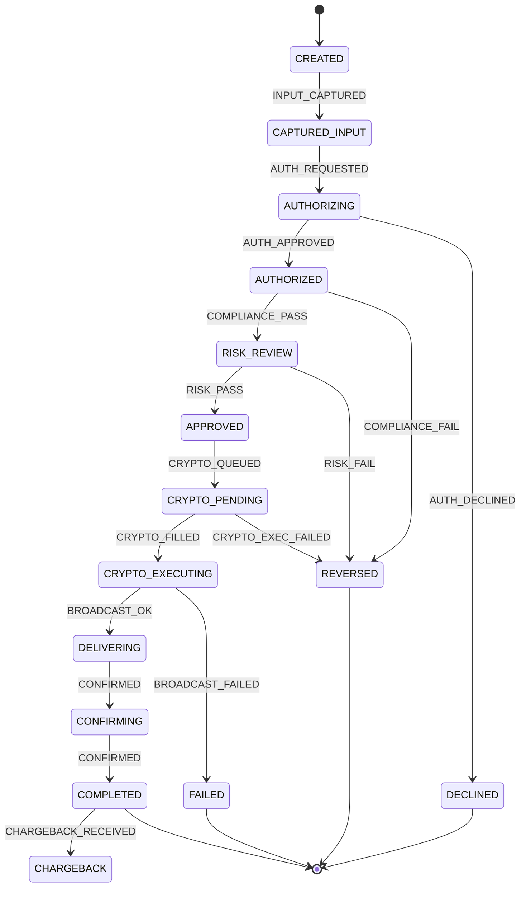
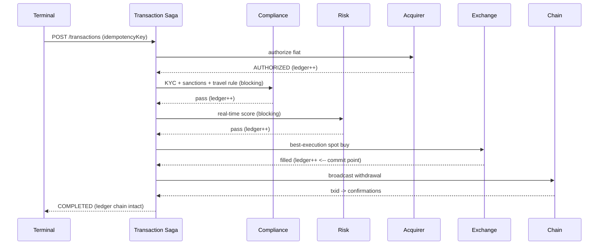

# PROJECT TITAN — Architecture Diagrams (Deliverables 1–4, 7, 9)

Rendered with Mermaid (GitHub/most viewers render natively).

## 1. System Architecture



## 2. Android Architecture



## 3. Backend Architecture (NestJS microservices)



## 4. Firmware Boot / Security Chain

```mermaid
sequenceDiagram
  participant ROT as HW RoT (eFuse)
  participant BL as Bootloader (locked)
  participant K as Kernel (dm-verity)
  participant TEE as KeyMint/StrongBox
  participant L as Launcher (COSU)
  participant BE as Backend Device Svc
  ROT->>BL: verify signature
  BL->>K: AVB verify boot image
  K->>TEE: mount verity system; unseal keys if green
  TEE-->>L: device keys available (attested boot only)
  L->>BE: enroll/attest (HW key attestation + Play Integrity)
  BE-->>L: short-lived mTLS session (only if attestation passes)
```

## 5. Transaction State Machine (Phase 4)



> Note the bright line after `CRYPTO_FILLED`: everything before is fiat-reversible
> (compensate → REVERSED); everything after is irreversible (→ FAILED + treasury case).

## 7. Event Flow (happy path, ledger-recorded)


